# 00 — Roadmap

> Documento vivo. Última actualización: **2026-08-07**.
> Fuente de verdad del **estado** del proyecto: este archivo + `git log --merges`.
> Fuente de verdad de los **paths canónicos**: este archivo + `docs/08-git-flow.md`.
> Si contradice a `CLAUDE.md` o a `README.md`, gana este archivo.

---

## 1. Principios

- **Una sola fuente de verdad para el "qué va después de qué".** Los detalles viven
  en `docs/01…10` y en `docs/superpowers/specs/` + `docs/superpowers/plans/`. El
  roadmap solo secuencia y referencia.
- **Cada hito tiene un DoD binario** (checklist) y, si ya está cerrado, un **PR de
  referencia real** (merge commit).
- **Cualquier cambio de secuencia o de DoD exige un PR con diff visible en este
  archivo.** No se reordena hitos a mano sin evidencia.

---

## 2. Hitos

Leyenda: ✅ Done · ⛔ Next inmediato · 🔜 Siguiente fase · ⏳ Backlog · ⏔ Hold

| Hito  | Nombre                                                  | Estado | PR de referencia                                | DoD (resumen)                                                                                                                                                                                                          | Bloqueado por |
| :---: | :------------------------------------------------------ | :----: | :---------------------------------------------- | :--------------------------------------------------------------------------------------------------------------------------------------------------------------------------------------------------------------------- | :------------ |
| **M0** | Docs base + hooks + scripts SQL + RBAC seed            |   ✅   | commits iniciales del repo                       | `docs/00…10`, `docs/adr/ADR-001…006`, `.githooks/{pre-commit,pre-push,commit-msg}`, `scripts/setup-hooks.sh`, `database/migrations/001…003.sql` + rollbacks.                                                           | —             |
| **M1a**| Scaffold backend + EF Core Power Tools                  |   ✅   | PR #2 `feature/ef-powertools-scaffold` (merge `23cbe35`) | `src/Leccionario.sln` con `Leccionario.Api` y `Leccionario.Tests`; 25+ entidades en `Domain/Entities/`; `HealthController` responde 200; `Program.cs` con todos los middlewares; `dotnet test` verde.            | M0            |
| **M1b**| Autenticación (login / refresh / logout / me)           |   ✅   | PR #3 `feature/auth-login` (merge `d8b9a1d`)    | `AuthController` + `AuthService` + `RefreshTokenService` + `JwtTokenService`; JWT con `codigo_sistema = cplec`; 95 tests verdes (verificado).                                                                          | M1a           |
| **M2** | Migraciones 001–003 aplicadas en **desarrollo**        |   ✅   | PRs previos + ejecución manual                   | Tablas `cplec_sesiones`, `cplec_asistencias`, `cplec_asistencias_historial`, RBAC seed. Aplicadas el 2026-08-06. Vacías.                                                                                              | M1a           |
| **M2b**| Asignar roles a personas reales                         |   ✅   | ejecución manual sobre `sigafi_es` dev          | `database/queries/asignar-roles-cplec.sql` ejecutado en dev; un docente y un inspector hacen login y llegan al dashboard correcto. **Bloqueante manual**: alguien con acceso a `sigafi_es` lo corre. | M1b           |

> **Nota operativa 2026-08-07:** el usuario de prueba (`1724649338`, inspector) se
> insertó manualmente en `usuarios` con `contrasenia` en texto plano. El flujo
> actual de `MigrarPasswordSiCorrespondeAsync` solo re-hashea desde un hash
> centinela, no desde texto plano. La contraseña quedó válida pero sin migrar
> a bcrypt. Es aceptable en desarrollo (cambia por auto-registro en el próximo
> flujo natural); **en producción no debe repetirse**.
| **M3a**| `DistributivoGuard` (pieza de seguridad)               |   ✅   | (en `dv_jb`) `feature/distributivo-guard`        | `IDistributivoGuard` con `DocenteTieneAsignacionAsync` + `EnsureDocenteTieneAsignacionAsync`; bypass explícito por `esInspector`; 15 tests (aislamiento, NULL legacy, vigencias, bypass, cancelación); registrado en DI. | M2b           |
| **M3b**| Endpoints núcleo de distributivo (3 endpoints GET)     |   ✅   | (en `dv_jb`) `feature/distributivo-endpoints`    | `GET /api/periodos/por-nivel`, `GET /api/mis-paralelos`, `GET /api/paralelos/{idAsignacion}/alumnos`; usan `DistributivoGuard`; 12 tests nuevos; total 122 tests verdes.            | M3a           |
| **M3c**| Sesiones y registro de asistencia                      |   ✅   | (en `dv_jb`) `feature/sesiones-asistencia`        | `POST /api/paralelos/{idAsignacion}/sesiones` (idempotente + ventana), `GET/PUT /api/sesiones/{idSesion}`, `POST .../cerrar`, `POST .../reabrir` (solo inspector + motivo), `POST .../asistencias` (idempotente + historial + transacción); 16 tests nuevos.            | M3b           |
| **M3d**| `MiPerfil` con paralelos reales                         |   ✅   | (en `dv_jb`) `feature/mi-perfil-paralelos`         | `GET /api/auth/me` consume `IMisParalelosService` y devuelve la nómina de paralelos del distributivo; inspectores ven lista vacía; 2 tests nuevos.            | M3c           |
| **M4** | Frontend Angular 21 + login + pasar lista              |   ✅   | (en `dv_jb`) `feature/frontend-bootstrap`       | `client/` con Angular 21 (standalone, signals, Vitest, Material); login funcional con refresh + interceptor + guards; mis paralelos y pasar lista ligados a M3; 24 tests frontend verdes; `npm run lint` y `npm run build` sin warnings. | M3d + `docs/06` actualizado |
| **M4b**| Horarios del inspector — backend                        |   ✅   | (en `dv_jb`) commit `abfc863`                    | 13 tareas TDD completadas, 91 tests nuevos (239 tests backend verdes total). Grid de horarios, CRUD de franjas Z, validación de solapamiento, operaciones por rango con topes, anclaje de sesión al horario, tardanza congelada y reportes del inspector. | M3c + ADR-008 |
| **M4c**| Horario del docente + asistencia anclada al bloque       |   ✅   | (en `dv_jb`) `feature/asistencia-anclada-horario` | `GET /api/mi-horario`; `SIN_HORARIO` retira el modo transición de ADR-008 §9; `AgendaService` por lote sin N+1; página `mi-horario` con grid semanal; `pasar-lista` exige `idHorarioInicio`. | M4b |
| **M5** | Reportes inspector + exportación XLSX/PDF              |   ⏳   | (a crear) `feature/reportes-core`               | Endpoints `/api/reportes/*` (por paralelo, por estudiante, por docente, resumen); UI inspector; exportación XLSX/PDF con `?formato=`.                                                                                    | M4 + M4b      |
| **M6** | Auditoría persistente + CI gate con cobertura          |   ⏳   | (a crear) `feature/auditoria-bd`                 | `AuditMiddleware` escribe en `gest_audit_registros`; CI exige cobertura mínima (umbral a definir en ADR).                                                                                                            | M3            |
| **Prod** | Despliegue a producción `sigafi_es`                  |   ⏔   | —                                               | Backup verificado; 001–003 aplicadas en orden; rollback probado; sin secretos en repo; smoke test de `/api/auth/me` con persona real.                                                                                  | M3 + M5 (parcial) |

---

## 3. Dependencias

```mermaid
flowchart LR
  M0[M0: Docs + hooks + SQL] --> M1a[M1a: Scaffold backend + EF]
  M1a --> M1b[M1b: Auth login/refresh/me]
  M1b --> M2b[M2b: Asignar roles a personas<br/>database/queries/asignar-roles-cplec.sql]
  M2b --> M3a[M3a: DistributivoGuard]
  M3a --> M3b[M3b: Endpoints distributivo<br/>GET 3 endpoints]
  M3b --> M3c[M3c: Sesiones + asistencia<br/>POST + transacción + historial]
  M3c --> M3d[M3d: /api/auth/me<br/>con paralelos reales]
  M3d --> M4[M4: Frontend Angular 21<br/>+ login + pasar lista]
  M3d --> M6[M6: Auditoría BD + CI gate]
  M4 --> M4b[M4b: Horarios inspector]
  M4b --> M4c[M4c: Mi horario docente<br/>+ asistencia anclada]
  M4c --> M5[M5: Reportes inspector]
  M5 --> Prod[Prod: deploy sigafi_es]
  M6 --> Prod
```



Notas:

- **M2b** no es automatizable por código: alguien con acceso a `sigafi_es` debe
  ejecutar `database/queries/asignar-roles-cplec.sql` sobre personas reales con
  `WHERE` explícito. Es el primer cuello de botella manual del proyecto.
- **M3** es la pieza de seguridad más crítica. **No se implementa M4 ni M5 sin M3
  cerrado**, porque ambos consumen endpoints que reciben `idAsignacion`/`idSesion`
  y deben pasar por `DistributivoGuard`.
- **M4** y **M6** pueden avanzarse en paralelo después de M3.

---

## 4. Paths canónicos

> **Source of truth de paths.** Reescribe cualquier mención de `Backend/` o `Frontend/`
> que aparezca en otros documentos.

| Concepto                  | Path real                                          | Notas                                                                                       |
| :------------------------ | :------------------------------------------------- | :------------------------------------------------------------------------------------------ |
| Solución .NET             | `src/Leccionario.sln`                              | Renombrada desde `Backend/` (intencional).                                                  |
| Proyecto API              | `src/Leccionario.Api/`                             | `Domain/Entities/` plano, generado por EF Core Power Tools.                                 |
| Proyecto tests            | `src/Leccionario.Tests/`                           | MSTest + Moq + FluentAssertions.                                                            |
| Frontend (a scaffoldear)  | `client/`                                          | Vacío (solo `.gitkeep`). Se crea en M4.                                                     |
| Documentación             | `docs/{00…10}-*.md`, `docs/adr/ADR-NNN-*.md`       | Numerada; leer en orden.                                                                    |
| Specs / plans             | `docs/superpowers/{specs,plans}/`                  | Naming `<YYYY-MM-DD>-<feature>-<{design,implementation}>.md`.                               |
| Hooks                     | `.githooks/{pre-commit,pre-push,commit-msg}`        | Activar con `scripts/setup-hooks.sh`.                                                       |
| Base de datos             | `database/{migrations,rollback,queries}/`           | `.sql` versionados, sin EF migrations.                                                      |

Comandos canónicos (sustituyen los de `README.md` sección "Arranque rápido" y `CLAUDE.md` sección "Comandos"):

```bash
# Backend
cd src && dotnet restore && dotnet test && dotnet run --project Leccionario.Api

# Frontend (cuando exista client/, en M4)
cd client && npm ci && npm test && npm run lint && npm run build
```

---

## 5. Estado actual — corregido

> **Esto sustituye a la sección homónima de `CLAUDE.md`.**

- ✅ **M0 — Plataforma**: docs, hooks, scripts SQL, RBAC seed.
- ✅ **M1a — Scaffold backend + EF Power Tools** (PR #2, merge `23cbe35`).
- ✅ **M1b — Auth login/refresh/logout/me** (PR #3, merge `d8b9a1d`).
- ✅ **M2 — Migraciones 001–003 aplicadas en desarrollo** (2026-08-06). Tablas
  `cplec_sesiones`, `cplec_asistencias`, `cplec_asistencias_historial` existen y
  están vacías. Sistema `cplec` y dos roles en RBAC.
- ✅ **M2b — Roles asignados a personas** (2026-08-07). Un docente y un inspector
  hacen login y llegan al dashboard. Detalle operativo: el usuario de prueba
  quedó con `contrasenia` en texto plano por inserción manual.
- ✅ **M3a — `DistributivoGuard` implementado** (en `dv_jb`).
  15/15 tests verdes. Pieza de seguridad más crítica lista.
- ✅ **M3b — Endpoints de distributivo implementados** (en `dv_jb`).
  `GET /api/periodos/por-nivel`, `GET /api/mis-paralelos`, `GET /api/paralelos/{idAsignacion}/alumnos`.
- ✅ **M3c — Sesiones y asistencia implementados** (en `dv_jb`).
  `POST/GET/PUT /api/sesiones`, `cerrar`, `reabrir`, `asistencias` con transacción e historial.
- ✅ **M3d — `/api/auth/me` con paralelos reales** (en `dv_jb`). Inspector ve
  lista vacía. Total 140/140 tests verdes.
- ✅ **M4 — Frontend Angular 21 bootstrap** (en `dv_jb`). `client/` scaffoldeado;
  login con refresh; mis paralelos; pasar lista (ciclo presente→ausente→atraso→justificado,
  guardado idempotente, indicador "sin guardar", `beforeunload` con cambios pendientes).
  24 tests frontend verdes. Backend sigue 140/140. CI frontend deja de omitirse.
- ✅ **M4b — Horarios del inspector (backend)** (en `dv_jb`, commit `abfc863`). 13 tareas TDD completadas
  con 91 tests nuevos. **239 tests backend verdes**. Grid semanal de horarios, catálogo de franjas Z,
  solapamiento de rangos, operaciones por rango con topes (16 semanas, 500 filas), anclaje de sesión al horario,
  tardanza congelada y reportes de tardías/días sin registrar para el inspector.
- 🔜 **Próxima fase (M5)**: reportes inspector con exportación XLSX/PDF.
- ⏔ **Producción**: sin aplicar hasta cerrar M5.

---

## 6. Definition of Done (DoD) global

Un PR se considera mergeable solo si cumple **todo**:

1. Commits con conventional commits (`feat(…):`, `fix(…):`, `docs(…):`, `ci(…):`, etc.).
2. `dotnet test` en verde para cambios backend; `npm test && npm run lint && npm run build`
   en verde para cambios frontend.
3. Sin secretos nuevos en el diff (verificado por `pre-commit`).
4. Sin tocar `src/Leccionario.Api/Domain/Entities/` a mano (regla 2 de `CLAUDE.md`).
5. Si crea/modifica una migración, su `database/rollback/*_rollback.sql` correspondiente
   commiteado en el mismo PR.
6. Si introduce un endpoint nuevo bajo `/api/asistencias`, `/api/sesiones` o
   `/api/mis-paralelos` (o `/api/paralelos/*`), **debe pasar por `DistributivoGuard`**
   y tener tests de aislamiento de distributivo (positivos y negativos).
7. Si cambia el contrato HTTP, sincroniza `docs/04-contrato-api.md` en el mismo PR.
8. Si introduce una dependencia nueva, abre un ADR en `docs/adr/`.

---

## 7. Política de actualización

- **Triggers** (cualquiera obliga a actualizar este archivo en el mismo PR):
  - Merge de un PR referenciado en la tabla sección 2 → mover de columna.
  - Apertura de un PR que introduce un nuevo hito → añadir fila.
  - Cambio de secuencia entre hitos → modificar el grafo sección 3 y la columna "Bloqueado por".
  - Cambio de paths canónicos → modificar sección 4.
- **Cadencia**: cada cierre de hito (M-impar terminado) o al menos una vez por release
  a `develop`, lo que ocurra primero.
- **Quién actualiza**: el autor del PR. El revisor **rechaza** el PR si el roadmap
  no se actualizó cuando correspondía.
- **Pie obligatorio** al final de cada cambio:
  `> Última actualización: <YYYY-MM-DD> por <rama> — motivo: <cambio>`.
- **Prohibido**: borrar hitos ya completados (se quedan con ✅ como histórico);
  mover ✅ a otra columna sin merge commit real.

---

## 8. Backlog explícitamente fuera de v1

Referencia: [`docs/00-vision-alcance.md`](docs/00-vision-alcance.md) sección "Fuera (v1)".

| Idea                                          | Prioridad | Ticket / nota                                                                                  |
| :-------------------------------------------- | :-------- | :--------------------------------------------------------------------------------------------- |
| Prácticas de manejo y vehículos (`cond_*`)    | baja      | Necesita modelo aparte; sin sponsor.                                                            |
| Planificación de horarios (armado de horario) | media     | Útil, pero `horario_detalle` está vacío para carrera 6; depende de decisión institucional.      |
| Cálculo de notas / actas                      | baja      | Sistema aparte; fuera de alcance del leccionario.                                                |
| Migración de `matriculas_asistencias`         | nula      | Se conserva tal cual; ver ADR-001.                                                              |
| Notificaciones a estudiantes / representantes  | baja      | Sin sponsor; sumaría complejidad de infraestructura.                                            |
| Multi-idioma del frontend                     | baja      | ISTPET opera en español; no se requiere.                                                        |

---

## 9. Cómo corregir la contradicción documental (PR único)

> Esto se ejecutó en el PR que introdujo este archivo.

1. ✅ Crear `docs/00-roadmap.md`.
2. ✅ Alinear `README.md` a `src/` + `client/` y enlazar este roadmap.
3. ✅ Alinear `CLAUDE.md` a `src/` + `client/`, reemplazar el resumen de "Estado actual"
   por el de sección 5 y corregir la afirmación "Backend y frontend: sin scaffoldear".
4. ✅ Alinear `docs/06-lineamientos-frontend.md` a `client/` (`ng new client`).
5. Verificación de follow-up (en el PR de roadmap):
   - `grep -RIn 'Backend/' README.md CLAUDE.md docs/00-roadmap.md docs/06-lineamientos-frontend.md` → 0 resultados.
   - `grep -RIn 'cd Frontend' README.md CLAUDE.md docs/06-lineamientos-frontend.md` → 0 resultados.

---

> Última actualización: 2026-08-07 — motivo: cierre de M4 (bootstrap
> frontend Angular 21 en `client/` con login, mis paralelos y pasar lista;
> 24 tests frontend + 140 tests backend verdes; sigue en `dv_jb`,
> pendiente de commit y merge).